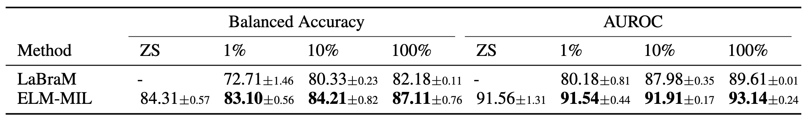
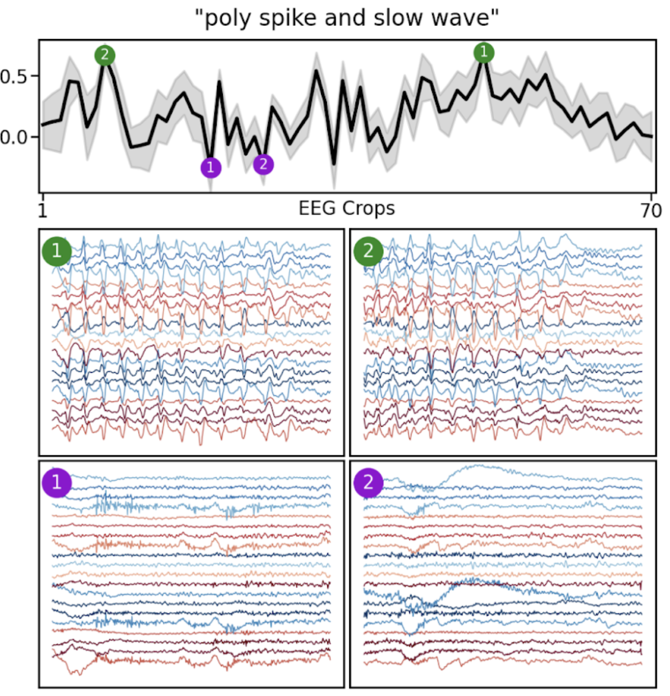

# EEG-Language Pretraining for Highly Label-Efficient Clinical Phenotyping

**Authors:** Sam Gijsen, Kerstin Ritter

📄 Paper link (OpenReview): https://openreview.net/forum?id=yaI2ZYFmeD

This repository provides the code and pretrained models for the ICML 2025 paper **"EEG-Language Pretraining for Highly Label-Efficient Clinical Phenotyping"**, introducing EEG-Language Models (ELM).


We show that our multimodal models using brain signals (EEG) and clinical reports:
- improve downstream disease detection across evaluations 
- for the first time enables retrieval of both brain signals and clinical reports
- for the first time enables zero-shot classification of brain signals via clinical text prompts


This codebase provides implementations for:
* Preprocessing clinical EEG data from the TUH EEG Corpus.
* Multimodal pretraining on EEG epochs and clinical text reports.
* Linear probing of the pretrained EEG encoders on downstream classification tasks.

<br>
<br>

<div align="center">
  
  <br>
  <i>Zero-shot and linear probing for abnormality detection.</i>
</div>

<br>

<div style="text-align: center;">
  
  <br>
  <i>ELMs enable clinical event retrieval based on natural language prompts.</i>
</div>


## Setup

1.  Clone the repository:
    ```bash
    git clone https://github.com/SamGijsen/ELM.git
    cd ELM
    ```
2.  Install the required dependencies:
    ```bash
    # Install PyTorch with conda (with CUDA support)
    conda install pytorch=1.12.1 torchvision=0.13.1 torchaudio=0.12.1 cudatoolkit=11.3 -c pytorch

    # Then install the rest with pip
    pip install -r requirements.txt
    ```
## Data Preprocessing

The models are expect preprocessed EEG data. We provide the preprocessing code in `utils/`.

### Preprocessing Steps:

The script `utils/preprocess_TUEG.py` can be adapted for your own datasets. Our preprocessing pipeline includes the following steps:

*   **Bandpass filter:** 0.1 - 49Hz
*   **Resampling:** 100Hz
*   **Amplitude clipping**
*   **Montage:** 20-channel longitudinal bipolar TCP montage using the channels below.

#### Channels
```
"Fp1-F7", "F7-T3", "T3-T5", "T5-O1",
"Fp2-F8", "F8-T4", "T4-T6", "T6-O2",
"T3-C3", "C3-Cz", "Cz-C4", "C4-T4",
"Fp1-F3", "F3-C3", "C3-P3", "P3-O1",
"Fp2-F4", "F4-C4", "C4-P4", "P4-O2"
```


## Data Format

The framework expects data in the HDF5 (`.h5`) format. For pre-training, the `.h5` file must contain the following fields:

*   **Required Fields:**
    *   `features`: A 3D NumPy array with shape `(n_total_samples, n_channels, n_timesteps)` containing the EEG data. This can also be named `embeddings`.
    *   `subject_ids`: A 1D NumPy array of shape `(n_total_samples,)` containing the subject ID for each sample.
    *   `dataset_mean`: A scalar or array used for normalizing the `features`.
    *   `dataset_std`: A scalar or array used for normalizing the `features`.

*   **Optional Fields:**
    *   `age` (or `ages`), `sex`, `pathology` (or `pat`), `epoch_ids`: 1D NumPy arrays of shape `(n_total_samples,)` that can be used for data stratification or as labels.

Clinical reports are loaded from a separate line-delimited JSON file, which must contain a `report` field with the text and use the subject ID as its index.


## Multimodal Pretraining

To run the multimodal self-supervised pretraining, use the `run_DL.py` script.

You will need a YAML configuration file to specify the model, dataset, and training parameters. Example configuration files can be found in the `pretrained/` directories (`pretrained/5s/config_xy.yaml` and `pretrained/60s/config_xy.yaml`).

In your config file, ensure the `setting` under `training` is set to `SSL_PRE`.

To launch the pretraining, use `torchrun`:
```bash
torchrun --nproc_per_node=1 run_DL.py -f your_config.yaml
```

## Workflow for Linear Probing

For linear probing on a downstream task, you first generate embeddings with a frozen pretrained encoder, and then train a linear model on top of these embeddings.

### 1. Generating Embeddings

To generate EEG embeddings from a pretrained model, you can use the `"GEN_EMB"` setting in `run_DL.py`.

1.  **Configure**: In your `.yaml` configuration file, set the `setting` under the `training` section to `"GEN_EMB"`. You also need to specify the path to your pretrained model in `cfg["model"]["pretrained_path"]`.

2.  **Run Embedding Generation**: Execute `run_DL.py` with your config file:

    ```bash
    python run_DL.py -f your_config.yaml
    ```

    This will create a new HDF5 file named `embedding_dataset.h5` inside your model's directory, containing the generated embeddings.

### 2. Linear Probing

Once you have the `embedding_dataset.h5` file, you can perform linear probing by using the `run_ML.py` script.

This script also requires a YAML configuration file. In the config, set the `setting` to `SSL_LIN` and specify the path to your `embedding_dataset.h5` file.

Run the linear evaluation with:
```bash
python run_ML.py -f your_linear_eval_config.yaml
```
This will perform a cross-validation over the hyperparameters defined in the config file.

## Pretrained Models

We provide two pretrained EEG encoders:
*   `./pretrained/5s/`: Trained on 5-second EEG epochs and clinical text.
*   `./pretrained/60s/`: Trained on 60-second EEG epochs and clinical text.

### Usage Example

The following Python code demonstrates how to load a pretrained model and extract representations. This example uses the 5-second model, but the 60-second model can be loaded by changing the `config_path` and `weights_path`.

```python
import torch
import yaml
from models.models import EEG_ResNet

# Setup device
device = torch.device("cuda" if torch.cuda.is_available() else "cpu")

# Paths for the 5-second model
config_path = 'pretrained/5s/config_xy.yaml'
weights_path = 'pretrained/5s/model_0_checkpoint.pt'

# Load configuration
with open(config_path, 'r') as file:
    config = yaml.safe_load(file)

# Initialize model from config
mp = config["model"]
encoder = EEG_ResNet(
    in_channels=mp["in_channels"],
    conv1_params=mp["encoder_conv1_params"],
    n_blocks=mp["encoder_blocks"],
    res_params=mp["encoder_res_params"],
    res_pool_size=mp["encoder_pool_size"],
    dropout_p=mp["encoder_dropout_p"],
    res_dropout_p=mp["res_dropout_p"],
    proj_size=mp["ELM"]["eeg_proj_size"]
).to(device)

# Load pretrained weights
state_dict = torch.load(weights_path, map_location=device)

# The models were trained with DDP, so we adjust the state dict keys
if config["training"]["DDP"]:
    new_state_dict = {key.replace("module.", ""): value for key, value in state_dict.items()}
    state_dict = new_state_dict

encoder.load_state_dict(state_dict)
encoder.eval()

# Create synthetic data
batch_size = 4
n_channels = mp["in_channels"]
n_time_samples = mp["n_time_samples"]
synth_data = torch.randn(batch_size, n_channels, n_time_samples, device=device)

# Get embeddings
with torch.no_grad():
    emb, proj_emb = encoder(synth_data)

print(f"Representation shape from encoder: {emb.shape}")
print(f"Projected representation shape from encoder: {proj_emb.shape}")
```

## Citation

If you use these models or code in your research, please cite our paper - thanks!


```@inproceedings{
gijsen2025eeglanguage,
title={{EEG}-Language Pretraining for Highly Label-Efficient Clinical Phenotyping},
author={Sam Gijsen and Kerstin Ritter},
booktitle={Forty-second International Conference on Machine Learning},
year={2025},
url={https://openreview.net/forum?id=yaI2ZYFmeD}
}
```

